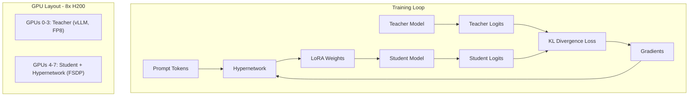

# Hypernetwork Distillation Implementation Walkthrough

**Completed**: 2026-02-05

## Summary

Implemented a complete Hypernetwork-based Knowledge Distillation system to train Qwen3-Coder-Next (80B MoE, 3B active) to match the agentic coding behavior of Qwen3-Coder-480B using SWE-bench trajectories.

---

## Architecture Overview



---

## Created Files

### Core Implementation

| File | Purpose |
|------|---------|
| [hypernetwork.py](file:///home/marcel/Work/hypernetowrk/src/hypernetwork.py) | PromptEncoder + LoRAGenerators for both Attention and DeltaNet layers |
| [lora_injection.py](file:///home/marcel/Work/hypernetowrk/src/lora_injection.py) | Dynamic LoRA weight injection via hooks/context managers |
| [training.py](file:///home/marcel/Work/hypernetowrk/src/training.py) | Full training loop with Top-K KL divergence and checkpointing |
| [data_loader.py](file:///home/marcel/Work/hypernetowrk/src/data_loader.py) | SWE-bench trajectory loading, filtering, and tokenization |
| [cluster_config.py](file:///home/marcel/Work/hypernetowrk/src/cluster_config.py) | 8x H200 infrastructure with vLLM Teacher + FSDP Student |

### Entry Points

| File | Purpose |
|------|---------|
| [train.py](file:///home/marcel/Work/hypernetowrk/scripts/train.py) | Main training script with CLI |
| [download_data.py](file:///home/marcel/Work/hypernetowrk/scripts/download_data.py) | Dataset download and preprocessing |
| [test_gradient_flow.py](file:///home/marcel/Work/hypernetowrk/tests/test_gradient_flow.py) | Pre-flight verification tests |

### Configuration

| File | Purpose |
|------|---------|
| [train_config.yaml](file:///home/marcel/Work/hypernetowrk/configs/train_config.yaml) | All training hyperparameters |
| [requirements.txt](file:///home/marcel/Work/hypernetowrk/requirements.txt) | Dependencies |
| [README.md](file:///home/marcel/Work/hypernetowrk/README.md) | Project documentation |

---

## Key Design Decisions

### 1. Hybrid Architecture Support

> [!IMPORTANT]
> The Student model (Qwen3-Coder-Next) has a **hybrid layout** with 75% DeltaNet layers and 25% standard Attention layers.

The Hypernetwork generates LoRAs for **both** layer types:
- **Attention layers (12 blocks)**: `q_proj`, `k_proj`, `v_proj`, `o_proj`
- **DeltaNet layers (36 blocks)**: `linear_q`, `linear_k`, `linear_v`

### 2. Zero Initialization

The Hypernetwork's **B matrix output heads** are initialized to zero:

```python
# From hypernetwork.py
nn.init.zeros_(self.head_B.weight)
nn.init.zeros_(self.head_B.bias)
```

This ensures:
```
Step 0: Student(x, LoRA) ≈ Student(x)
```

### 3. Top-K KL Divergence

Instead of transferring full vocab logits (150k), we use **Top-128 only**:

```python
# From training.py
teacher_topk_values, teacher_topk_indices = torch.topk(teacher_logits, k=128, dim=-1)
student_topk_values = torch.gather(student_logits, dim=-1, index=teacher_topk_indices)
```

This provides **~1000x bandwidth reduction** between GPU groups.

### 4. Shared Generator with Layer Embeddings

Instead of separate generators per layer (~500M params), we use:
- Layer embeddings: `[num_layers, hidden_dim]`
- Module embeddings: `[num_modules, hidden_dim]`
- Shared generator network

**Result**: ~50M parameters in Hypernetwork (10x reduction)

---

## Project Structure

```
hypernetowrk/
├── src/
│   ├── __init__.py
│   ├── hypernetwork.py      # Core Hypernetwork architecture
│   ├── lora_injection.py    # Dynamic LoRA application
│   ├── training.py          # Training loop
│   ├── data_loader.py       # Dataset handling
│   └── cluster_config.py    # GPU infrastructure
├── tests/
│   └── test_gradient_flow.py
├── scripts/
│   ├── download_data.py
│   └── train.py
├── configs/
│   └── train_config.yaml
├── requirements.txt
└── README.md
```

---

## Next Steps

1. **Install dependencies** on target cluster:
   ```bash
   pip install -r requirements.txt
   ```

2. **Run pre-flight tests**:
   ```bash
   python tests/test_gradient_flow.py
   ```

3. **Download and filter dataset**:
   ```bash
   python scripts/download_data.py --output_dir ./data
   ```

4. **Start training**:
   ```bash
   # Single GPU test
   python scripts/train.py --dry_run
   
   # Full 8x H200 cluster
   torchrun --nproc_per_node=8 scripts/train.py --config configs/train_config.yaml
   ```

---

## Estimated Training Time

| Phase | Duration | Samples | Context |
|-------|----------|---------|---------|
| Warmup | 4 hours | 1k | 8k tokens |
| Main Training | 32 hours | 20k × 20 epochs | 8k tokens |
| Context Annealing | 8 hours | 20k | 32k tokens |
| **Total** | **~44 hours** | | |
